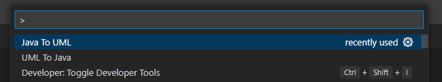

# `Java / UML Translator`

## Intro

This project is an Visual Studio Code (VSC) extension that translate an UML Class Diagram into a Java source code.

In the futur you will be able to extract a diagram from java files.

If you're not familiar with plantuml I suggest you to browse [their website](https://plantuml.com/fr/)

## Compatibility

Works on every version of VSC until 1.55.0, to see if your version is higher, you can open the About panel in the Help section :


## Installation as an extension

This project is distributed as an Visual Studio Code extension.

If you just want to get the extension on your VSC you can download [the latest package](https://github.com/ThalesGroup/lumber/javaumltranslator/-/jobs/artifacts/main/download?job=package).

**Check out the [latest release](https://github.com/ThalesGroup/lumber/javaumltranslator/-/releases/permalink/latest) for more informations on the latest changes !**

Then install it via the extension panel :


## Installation from source code

### \[Build\] With the digitalFactory

Hopefully for you, this project works with the registry provided by the digitalFactory, just run these commands :

```sh
npm install # Install dependencies
npm run build # Build project
```

After that you should have a **dist/** folder filled with the project scripts

### \[RUN\] Start the project

I assume that you have successfully installed all dependencies and build the projet.

If this doesn't work for you or if you wan't to start the project from the code you can simply clone the repo.
You can build the project with `npm run build` and start it by pressing `F5` on VSC with the workspace set on the root folder of the project, where the package.json is located.

## Usage

At this time you should have a working extension named Java / UML Translator on a VSC window, if not please refer to the section [Installation](#installation) section.

### PlantUML to Java

To use it just do a right click on an PlantUML file and you should see a `UML To Java` button just above the `rename...` button.


Then a window will appear to asks you in which folder you want to save the java files.


If you are editing a plantUML diagram you can also translate this diagram by executing the commande `UML To Java` from the `Commande Palette (CTRL+SHIFT+P)`.


### Java to PlantUML

Reverse code into a diagram is as simple as generating code, you just have to do a right click on a folder and then click on Java To UML.


You can also do that by executing the command from the `Commande Palette (CTRL+SHIFT+P)`, it will then asks you to select the start folder.




_The reverse engineering will recursivly retrieve all java files located in subdirectories !_

## Test

You can launch test by executing `npm test`