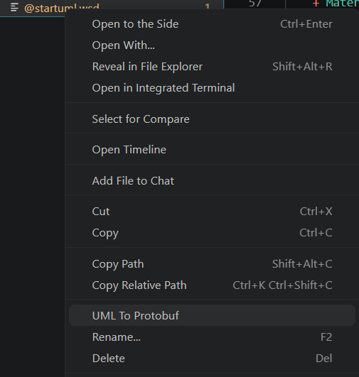
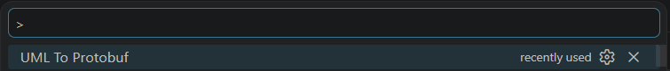
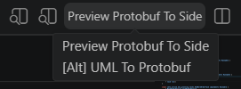

# ProtobufUmlTranslator

ProtobufUmlTranslator is a project that allows the user to generate Protobuf description files from a PlantUML diagram.

## Visuals

Depending on what you are making, it can be a good idea to include screenshots or even a video (you'll frequently see GIFs rather than actual videos). Tools like ttygif can help, but check out Asciinema for a more sophisticated method.

## Installation

### Extension installation

**Check out the [latest release](https://github.com/ThalesGroup/lumber/releases/latest) to download and install the latest version of this extension !**

> To install a VSIX, just open the extension tab on Visual Studio Code, then click on the three dot icon and select "Install from VSIX..."

### Development installation

This project is dependent of the [**datamodel project**](../datamodel/), you must follow the instruction on this project **before** continuing.

To install the ProtobufUmlTranslator project, you must execute the following command:

```sh
npm install
```

To launch the project:

-   go on the Run and Debug tab of a Visual Studio Code editor
-   Ensure that the correct launch script is selected
-   Press **F5** or click on the **Start Debugging** button

A new Visual Studio Code window will open in a **[Extension Development Host]** mode.

## Test

You can always test your version by using the **`npm test`** command.

## Usage

You can generate a protobuf file from a valid plantuml file by doing a right click on the file explorer view:



You can also use the "UML to Protobuf" command (**CTRL + SHIFT + P**) while editing a PlantUML file:



Or use the "Preview to the side" feature:



## VSIX (Extension) generation

To generate a VSIX, a VSCode archive that you can import as an extension in a Visual Studio Code editor, you just have to execute the following command: **`npm run package`**.

A VSIX file should appear in the projet file system.

## Roadmap

Currently, it's only possible to generate Protobuf from a PlantUML diagram. The next step would be to implement a code parser to extract a PlantUML diagram from protobuf file(s).

## Contributing

See [**CONTRIBUTING.md**](../CONTRIBUTING.md).

## License

See [**LICENSE.md**](./LICENSE.md)
